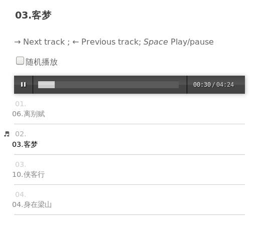

# gen_music_list
generate music list html,  use audiojs mp3 player 

music player : [audio.js](https://github.com/kolber/audiojs)

为web服务器下指定目录下的mp3文件生成在线播放列表

## var

mp3 directory : mp3/

web path :  http://music.xxx.com/music/

## usage

perl gen_music_list.pl [web_path] [filename]

generate http://music.xxx.com/music/music.html : 

perl gen_music_list.pl http://music.xxx.com/music/ 

generate http://music.xxx.com/music/test.html : 

perl gen_music_list.pl http://music.xxx.com/music/  test

